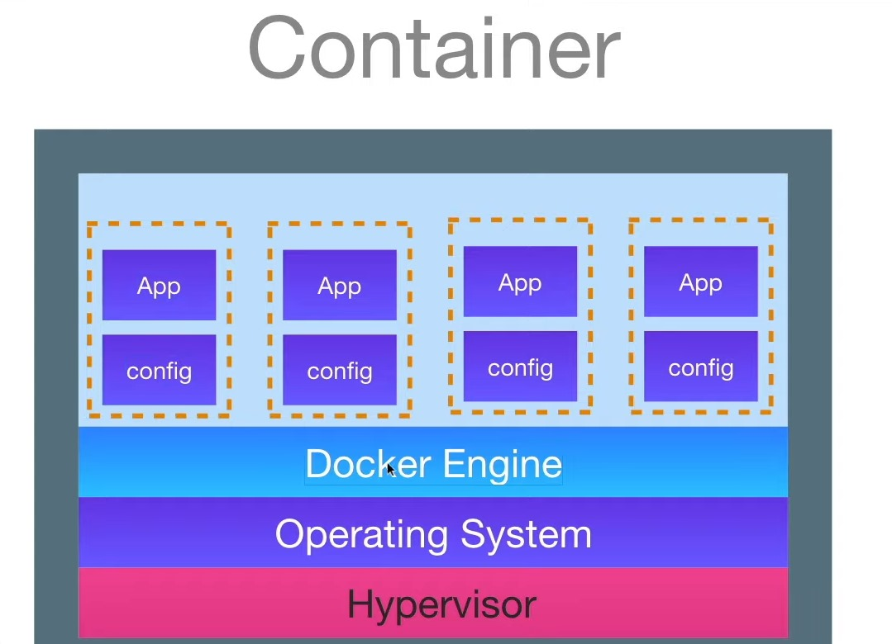

# Docker

Docker is a platform that allows developers to develop, package, deploy, and run applications using containers. It provides a set of tools and services that make it easier to create and manage containers.

# Container

A container is a lightweight, standalone, and executable package that contains everything needed to run a piece of software, including the code, runtime, system tools, libraries, and settings.

Think of it as a small, self-sufficient unit that can run any application, regardless of the environment it's deployed in. Containers isolate applications from their environment, ensuring that they run consistently across different environments.

Docker helps developers package their applications into containers, which can then be easily deployed and run on any platform that supports Docker. Containers provide a consistent and predictable environment for running applications, making it easier to develop, test, and deploy software.

# Hypervisor

A hypervisor, also known as a virtual machine monitor (VMM), is a software or firmware that creates and runs virtual machines (VMs). It enables multiple operating systems to share the same physical hardware resources, such as CPU, memory, storage, and networking, by abstracting and managing those resources.

There are two main types of hypervisors:

Type 1 hypervisor: Also known as a bare-metal hypervisor, it runs directly on the physical hardware of the host system. Examples include VMware ESXi, Microsoft Hyper-V, and Xen.

Type 2 hypervisor: Also known as a hosted hypervisor, it runs on top of a host operating system. Examples include VMware Workstation, Oracle VirtualBox, and Parallels Desktop.

Hypervisors are commonly used in data centers and cloud computing environments to consolidate and optimize hardware resources, improve server utilization, and enable efficient management and deployment of virtualized workloads. They play a crucial role in enabling virtualization, which has become a fundamental technology in modern IT infrastructure.



Operating System can be Windows, MacOS, Linux.

Docker Engine is a layer which is mostly Linux (docker version command - OS/Arch) which will containerize the application in isolated environment. 

# Few Docker commands

## Pulling an image from docker hub

```sh
docker pull [image_name]
Ex:
docker pull mongo
docker pull busybox
```
## List containers

```sh
docker container ls
or 
docker container ps
```

## List Images
```sh
docker ps
or
docker image ls
```

## Run a image to generate a container

```sh
docker run postgres:3.2

docker run [image_name]:[version]
or
docker container run [image_name]:[version]
```

## Remove/Delete a container

```sh
docker container rm [container_name]
docker image rm [image_name]
```

## Configure by giving Environment variables

```sh
docker run -p [host_port]:[container_port] -e [env_key]=[env_value] --name [container_name] -d [image_to_be_used]

Ex:
docker container run -p 4000:3000 -e POSTGRES_PASSWORD=password --name mypostgres -d postgres
```

> host_port: This is the port on your host machine. It means that you want to make the service running inside the container accessible from port 4000 on your host machine.

> container_port: This is the port inside the container. It's the port on which the service running inside the container is listening. In this case, it's port 3000.

>-p : publish in this port

> -d : detach mode, run the container in background and return back the terminal for use.

> --name : name given to your container

## Prune docker Images

```sh
docker image prune
or 
docker container prune
```
>Removes unused images or Removes all stopped containers

## Stop a container

```sh
docker container stop [container_name]
```

## Start a container

```sh
docker start [container_name]
```

## Docker Compose

A docker-compose.yaml file is a configuration file used with Docker Compose, which is a tool for defining and running multi-container Docker applications.
It is written in YAML (YAML Ain't Markup Language) format and defines the services, networks, volumes, and other configurations needed to run a multi-container application.
docker-compose.yaml files allow you to define the relationships between different containers, specify port mappings, volume mounts, environment variables, and other settings.
Docker Compose uses the docker-compose.yaml file to orchestrate the deployment and management of multiple Docker containers as a single application stack.

```sh
docker compose [OPTIONS] COMMAND
docker compose -f docker-compose.yaml up
```

>-f is the file name and "up" is command. "up" will create and run the containers

> docker compose file is ".yaml"/ ".yml"

>VScode extension: Indent-rainbow

docker-compose.yaml
```sh
version: '3'
services:
  mongodb:
    image: mongo
    ports:
      - "27017:27017"
    environment:
      - MONGO_INITDB_ROOT_USERNAME=admin
      - MONGO_INITDB_ROOT_PASSWORD=password
    volumes:
      - mymongo-data:/data/db 
  mongo-express:
    image: mongo-express
    ports:
      - "8081:8081"
    restart: always
    environment:
      - ME_CONFIG_MONGODB_ADMINUSERNAME=admin
      - ME_CONFIG_MONGODB_ADMINPASSWORD=password
      - ME_CONFIG_MONGODB_SERVER=mongodb
volumes:
  mymongo-data:
    driver: local
```

>Indentaion is mandatory

>Here we have 2 services mongodb and mongo-express. Each service has its image, ports, environment variables, volumes (data stored like DB user data).

>This will create 2 containers, mongo and mongo-express. restart:always will run the mongo-express container till the mongo connection is successful.

### Docker compose command

```sh
docker compose -f docker-compose.yaml up
```

---
---

# Dockerfile

A Dockerfile is a text file that contains a series of instructions for building a Docker image.
It defines the steps needed to create an image, including specifying the base image, adding dependencies, configuring environment variables, and running commands.
Dockerfiles are used with the docker build command to build Docker images.
They are typically used for defining the build process for a single Docker image.

```sh
FROM python:3-alpine3.15
WORKDIR /app
COPY . /app/
RUN pip install -r requirements.txt
EXPOSE 3000
CMD python ./index.py
```

1 Pulls image of python of that specific version
2 Creates a working directory /app
3 Copies all the files to /app
4Runs the command to install all the dependencies necessary to project from the file
5 This application is exposed in port 3000
6 CMD will run the command to start application

# Docker Containerization using Dockerfile

## Command to build the project

```sh
docker build -t [repository_name]/[project_name].0.0.1.RELEASE .
```

"." at the last means consider the docker file in this root directory
This command creates an image of specified requirements in Dockerfile

## Command to run the container

```sh
docker container run -d -p 4000:3000 [repository_name]/[project_name].0.0.1.RELEASE
```

## Command to push to remote docker repo

```sh
docker push [repository_name]/[project_name].0.0.1.RELEASE
```

This pushes code to the DockerHub Repository
